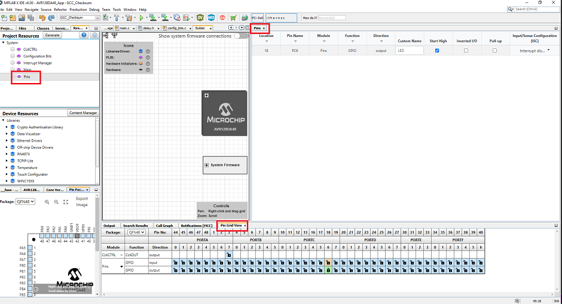

# Melody Bootloader Solution for AVR128DA48

## Introduction

This example uses the 8-bit Melody Bootloader library to show how to configure the bootloader on AVR128DA48 along with a simple LED blinking end application project. The bootloader will be programmed into the microcontroller using MPLAB X IDE and the end application will be programmed using UBHA ([Unified Bootloader Host Application](https://www.microchip.com/en-us/tools-resources/develop/libraries/microchip-bootloaders/8-bit)).

## Hardware Tools

1. [AVR128DA48 Curiosity Nano Evaluation Kit](https://www.microchip.com/en-us/development-tool/DM164151)
2. USB 2.0 A-Male to Micro B Cable

## Software Tools

1. [MPLAB X IDE v6.00 or later](https://www.microchip.com/en-us/tools-resources/develop/mplab-x-ide#tabs)
2. [MPLAB Code Configurator (Plugin) v5.1.17 or later](https://www.microchip.com/en-us/tools-resources/configure/mplab-code-configurator)
3. [XC8 Compiler v2.40 or later](https://www.microchip.com/en-us/tools-resources/develop/mplab-xc-compilers/downloads-documentation#XC8)
4. [AVR GCC Compiler v7.3.0 or later](https://www.microchip.com/en-us/tools-resources/develop/microchip-studio/gcc-compilers)
5. Melody Core v5.4.3 or later
6. [Java Runtime Environment v1.8.0_25 or older](https://www.oracle.com/java/technologies/javase/8u251-relnotes.html)
7. Unified Bootloader Host Application v1.19.1 or later([UBHA](https://www.microchip.com/en-us/tools-resources/develop/libraries/microchip-bootloaders/8-bit))

## Library Dependencies
1. UART v1.8.0 or later
2. Timer(Delay) v3.0.5 or later
3. NVMCTRL v7.0.0 or later
4. AVR Device Library v4.5.0 or later

## Related Documentation

1. [AVR128DA48 Datasheet](https://www.microchip.com/en-us/product/AVR128DA48)
2. [Bootloader Generator User's Guide](https://onlinedocs.microchip.com/oxy/GUID-C6916C91-B44E-4984-8A69-9C06B0E156FD-en-US-1/GUID-41C493BE-EE53-476B-B0B0-D106F168BCAD.html)
3. [MCC Melody Technical Reference](https://onlinedocs.microchip.com/pr/GUID-5A03F818-B7FC-4062-9792-57D08543B586-en-US-4/index.html?GUID-4FF6C8DE-2375-4456-9150-3ECCDAEB82B4)
4. Hexmate User Guide (Under the XC8 installation folder)   
  
  5. [MCC AVR and PIC16/18 Generic Bootloader Library Release Notes](https://onlinedocs.microchip.com/oxy/GUID-41B03AED-93FD-4454-BD01-4532EE71B9B5-en-US-2/GUID-47CBF3EF-7415-4F80-B0F4-E972F464D8F0.html)
6. [Bootloader 8-bit library changelog](https://www.npmjs.com/package/@mchp-mcc/bootloader-8bit?activeTab=readme)

## Setup

The AVR128DA48 Curiosity Nano Develpment Board is used as test platform. To setup the board, connect the device to the PC using the USB cable before proceeding on working with the project.   

# Bootloader Overview

  1. Open the bootloader project AVR128DA48_BL.X in MPLAB X IDE. Right Click on AVR128DA48_BL.X and Set as Main Project.  
    

  2. Open MCC from the toolbar.     
    

  3. Open CLKCTRL from System module in the Project Resources tab. Make sure the Clock source is configured. In general, faster is better for more reliable communication.   
    

  4. Open Bootloader8-bit driver under Libraries section in Project Resources. If the Bootloader driver is not available in the Project Resources, add it to the project by double clicking on it under Device Resources. If you cannot see the Bootloader module in the Device Resources, navigate to the library release notes and follow the steps located in the Installing MCC Melody Bootloader 8-Bit Library section.  
     
  
  5. Open UART module and make sure USART1 is selected in UART PLIB Selector drop-down list.  
    

  6. Open USART1_Peripheral tab from the Builder window. Make sure USART Receiver and USART Transmitter are enabled.  
    

  7. Now configure the Bootloader8-bit module. Configure the necessary options for your project and also select the Memory Verification scheme to be used.
    

  8. We need to configure the offset for the bootloader firmware. The remaining space in the flash after the offset will be populated with the End Application code. For AVR devices, the bootloader offset is set by populating the BOOTSIZE value in configuration options in the System Module/Configuration bits.  
    

  9. The BOOTSIZE defined here is the number of pages in the flash. AVR128DA48 has a total 256 pages each being 512Bytes in size as shown below.
      | Memory Region          | Formula to calculate                  | Memory Size                                 |
      | ---------------------- | ------------------------------------- | ------------------------------------------- |
      | Program Memory Size    | Total Pages x Page Size               | 100h(256) x 200h(512) bytes = 0x20000 bytes |
      | Config bits            |                                       | 20h(32)                                     |
      | Bootloader Area/Offset | No. of Pages x Page Size              | 20h(32) x 200h(512) = 0x4000 bytes          | 
      | End Application Space  | Program Memory Size - Bootloader Area | 0x20000 - 0x4000 = 0x1C000 bytes            |

    Make note of this value. We will later use these values in the linker settings of the application project.

    Physical properties of the flash memory are as follows    
 
  
  
  10. Open Delay driver from Timer module in the Project Resources tab. Generate delay driver is ON by default.  
    

  11. For the NVM driver, make sure Generate Flash APIs, Generate EEPROM APIs, Generate Signature Row APIs and Generate Fuse APIs are enabled.  
    
  
  12. Open the Pin Grid View. PC6 is used for the Bootloader Indication pin (output), PC7 is the Bootloader Entry pin (input), UART Tx and Rx are on PC0 and PC1. Select the Pin Module from the project resources, System option. Pins are configured to digital by deselecting the analog check box option for all the pins used. Make sure pull-up is enabled for RX and TX.  
  

  13. Press 'Generate' to generate the project code. Make sure the generation is completed successfully.  
    

  14. Next step is to configure the project properties. This can be opened by selecting "File->Project Properties". Select "AVR128DA48 Curiosity Nano" under Connected Hardware Tool, DFP version under Packs and the XC8 or AVR-GCC version under compiler toolchain. Also select the XC8 or GCC under Categories section based on the compiler selected.  
    

  15. We have completed the needed configurations for the Bootloader project. Compile and build the project by clicking the Clean and Build Main Project button on the toolbar.  
  
  16. Program the device by clicking "Make and Program Device Main Project" on the toolbar. Once the bootloader is programmed into the device sucessfully, you should see the device LED ON.  
  

## End Application

The end application really depends on what the customer wants the microcontroller to do. For testing purposes, it can be something as simple as a blinking LED. The example here will be for a AVR Curiosity Nano. However, it is practically the same procedure for all devices, the only thing that changes is the pin configuration which can be easily figured out from the schematics and datasheets.

  1. Open the end application project AVR128DA48_App.X in MPLAB X IDE. Right Click on AVR128DA48_App.X and Set as Main Project.  
    

  2.  Open MCC from the toolbar.  
    
  
  3. Open CLKCTRL from System module in the Project Resources tab. Make sure the Clock bits are configured to the settings observed in the bootloader. This will help during testing to prevent the configuration bits from causing a Checksum mismatch with UBHA.   

  4. On-board LED is configured by setting PC6 as output pin.  
    

  5. Press 'Generate' to generate the project code. Make sure the generation is completed successfully.

  6. For a blinking LED application, the following code is added to main.c in Source Files under the project folder. The delay.h header file must also be included in the main file.     
   

  7. Next step is to configure the project properties. This can be opened by selecting "File->Project Properties". Select "AVR128DA48 Curiosity Nano" under Connected Hardware Tool, DFP version under Packs and the XC8 or AVR-GCC version under compiler toolchain. Also select the same verification scheme that was selected in the MCC Melody Bootloader settings.  
    

  8. For the end application project, we also need to configure the linker setting and post-build scripts for the verification scheme used. Please checkout the "Compiler and Linker Settings" section for the details.

  9. We have completed the needed configurations for the end application project. Compile and build the project by clicking the Clean and Build Main Project button on the toolbar.

  10. The application HEX can be loaded on the microcontroller through Microchip's Unified Bootloader Host Application(UBHA).

## Compiler and Linker Settings

The following section is intended to provide an explanation of the compiler and linker settings utilized in the PIC18F57Q43 Application project. These settings are already configured in the examples, this is simply here to provide a depth of understanding and to provide help incase you want to try setting a new size.

Checksum, CRC16, CRC32 and Offset (Reset Vector and Status Flag) verification schemes are supported by the Bootloader library. The example below uses Checksum verification scheme for demonstration. For more details, refer Melody Bootloader User's Guide.

### Linker > Additional Options
* XC8 linker settings
    -Wl,-Ttext=0x4000 - Tell the linker to set the flash .text section to the specified address(offset). This offset is the same value we calculated in the Bootloader Overview section.  
  

* AVR-GCC linker settings  
    .text=0x2000
    For AVR devices, the offset is represented in words.  
  

  ### Post-build scripts
  For AVR devices, postBuild scripts to calculate Checksum and CRC verification schemes are added to the end application project. The calculated checksum will be stored in the footer of the Flash space. The postbuild scripts are available in the project folder.  
  

  To enable the use of these postbuild scripts, the end application project properties have to be updated. Open Building under categories and enable "Execute this line after build" checkbox. Add the below lines in the text box based on the verification scheme used.
  * Checksum - postBuildChecksum${ShExtension} ${ImagePath}
  * CRC16 - postBuildCRC${ShExtension} CRC16 ${ImagePath}
  * CRC32 - postBuildCRC${ShExtension} CRC32 ${ImagePath}

  Note: Make sure to enable the "Execute this line after build" checkbox to enable the execution of the Post Build Script.

  

## Application Hex file is programmed using the UBHA

The Unified Bootloader Host Application is a Java utility that was created to simplify the development and testing process for anyone configuring our basic bootloader. You will more than likely be writing your own host to interface with your specific bootloader firmware but UBHA will help you get started with the basic bootloader firmware present in the Melody 8-bit Bootloader Library.

The application HEX file is loaded in the controller using Microchip's Unified Bootloader Host Application. Before programming the controller with the Application HEX file, make sure the controller is programmed with the bootloader. 

 Follow the steps below to load a new firmware image onto the device.

   1. Download and Launch Unified Bootloader Host Application.   
   

   2. COM port for AVR128DA48 Curiosity Nano Board can be found out from the Device Manager.  
   

   3. Select AVR  device architecture.  
   

   4. Next step is to configure the serial port. This can be done through "Settings->Serial". Further, select the correct COM port and BaudRate.  
   

   5. Opening the console to get all the messages printed is ideal for debugging or communication failures. Console can be found under the 'Tools' tab.  
   

   6. Next, the hex file can be loaded by using the Open/Load file option under the 'File' tab. Once the end application is built in MPLAB X IDE, the generated .hex file can be found under the 'AVR128DA48_App.X\dist\Checksum\production' folder.     
    

   7. Click on the Program Device button. Once the device is programmed, the bootloader will disconnect from the COM port and the device LED should be blinking now.   
   

